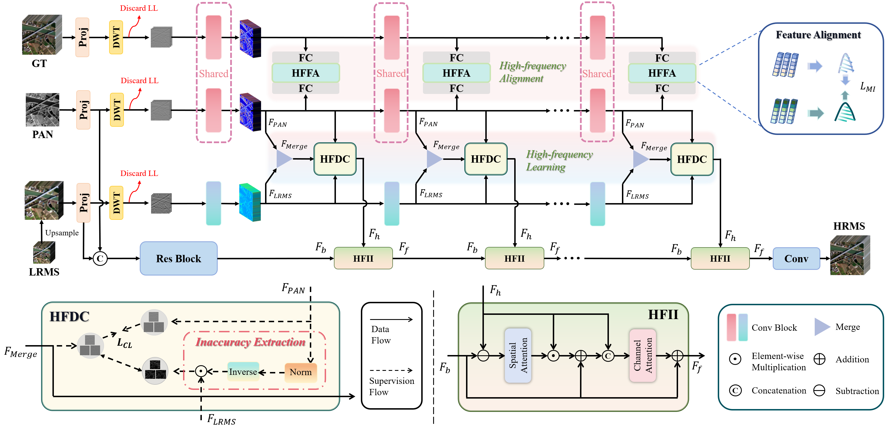

## A General Cooperative Optimization Driven High-Frequency Enhancement Framework for Multi-Spectral Image Fusion
---
**Background**: Existing methods in pan-sharpening tend to roughly fuse high-frequency components of PAN and LRMS images, overlooking cross-modality mismatch. This intrinsic inconsistency between PAN and MS modalities may potentially introduce spatial and spectral distortions, degrading the overall pan-sharpening performance. To be specific, most previous works merely use the reference HRMS images as training labels.

**Contributions**: This work presents a general high-frequency enhancement framework through a cooperative optimization strategy using mutual information (MI) maximization and contrastive learning:

1. Unlike previous works that only use GT images as training labels, we introduce an HFFA module implemented with MI maximization to constrain the high-frequency
consistency between PAN images and GT images, since the former are commonly used as the HR guidance to spatially super-resolve the LRMS.
2. Considering the inaccurate high-frequency details of LRMS images, we devise an HFDC module through contrastive learning constraints, aiming to calibrate the high-frequency information of MS modality under PAN guidance refined by the HFFA module.

